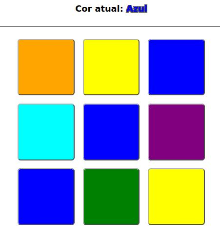

# 09-Jogo-das-Cores
### Nome: [Walisson Fernandes Dias](https://github.com/Murynga)
[Site](https://09-jogo-das-cores.vercel.app/) com um jogo relacionado a clicar nas cores corretas o mais rápido possível. Projeto feito como atividade para a disciplina de WEB I.

## Sumário 

- [Sumário](#sumário)
- [Regras do jogo](#regras-do-jogo)
- [Como jogar](#como-jogar)
- [Como executar](#como-executar)
- [Créditos](#créditos)
- [Licença do projeto](#licença-do-projeto)

## Regras do jogo

- O jogo começa ao clicar em `Jogar`;

- Após clicar em jogar, será requisitado que o usuário digite seu nome;

- Após iniciado, começará um timer de 15 segundos, e os 9 quadrados mudarão para cores aleatórias; 

> As cores possíveis são: verde, vermelho, azul, magenta, amarelo, roxo, ciano, laranja ou preto;

- aparecerá, acima dos quadrados, a cor correta em que o jogador deverá clicar;

    - Caso ele clique na cor correta, 10 pontos serão somados a sua pontuação, e as cores se alterarão;

    - Caso ele clique na cor errada, 5 pontos serão subtraídos de sua pontuação, e as cores se alterarão;

-  Jogo encerra quando o tempo se esgota;

- Ao fim do jogo, o nome e os pontos do jogador serão visíveis no placar de líderes;

- Ao clicar em `Placar de líderes`, será mostrado o placar com os melhores jogadores baseado em suas pontuações finais.

## Como jogar

Depois que o usuário clica em `Jogar` e confirma seu nome, o jogo dá início, começando o temporizador de 15 segundos, tempo esse que o jogador terá para clicar na cor especificada o mais rápido que conseguir;

Na captura de tela abaixo, podemos ver que o jogador deve clicar em um quadrado da cor azul - se ele clicar em um quadrado azul, ele receberá mais 10 pontos, mas se ele clicar em um quadrado de outra cor, ele perderá 5 pontos.

Quando o tempo se esgota, será apresentado ao jogador seu nome e pontuação, e ele poderá ver onde está o placar de líderes, clicando no botão `Placar de líderes`, e se desejar, ele poderá jogar de novo clicando em `Jogar` novamente.

  
Extra

  
  > Clique na logo para uma surpresa `:)`
  

## Como executar

Para jogar, apenas acesse o deploy [aqui](https://09-jogo-das-cores.vercel.app/). Apenas é necessário um navegador e conexão a internet.

## Créditos

Fontes que auxiliaram no desenvolvimento do HTML e CSS:

https://www.w3schools.com/css/css3_gradients.asp

https://www.w3schools.com/css/css_grid_columns_rows.asp

https://www.w3schools.com/css/css_grid.asp 

https://www.w3schools.com/css/css_border.asp

Fontes que auxiliaram no desenvolvimento do JavaScript:

https://arthurporto.notion.site/08-Javascript-DOM-22e06b94b9cb806bbe35fefaf11bad29

https://arthurporto.notion.site/07-Javascript-cb539285c3b9410485790ff0743095f0

https://www.w3schools.com/jsref/event_onclick.asp

https://www.w3schools.com/css/css3_transitions.asp

https://chatgpt.com/share/688ac763-1b1c-800a-a3d2-2cb971d08018

https://stackoverflow.com/questions/4847996/css-animation-onclick

https://www.w3schools.com/js/js_htmldom_eventlistener.asp

https://www.w3schools.com/cssref/tryit.php?filename=trycss_cursor

https://www.w3schools.com/js/js_array_sort.asp

https://www.w3schools.com/js/js_arrays.asp

https://www.w3schools.com/js/js_loop_forof.asp

https://chatgpt.com/s/t_688acc61fff08191a610d6ad6a954b05

https://www.w3schools.com/jsreF/prop_style_textshadow.asp

https://www.w3schools.com/jsref/prop_pushbutton_disabled.asp

https://www.w3schools.com/js/js_popup.asp

https://developer.mozilla.org/en-US/docs/Web/API/Window/localStorage

https://youtu.be/WTK_Li4ulKM

https://youtu.be/vMA3IC7Q8LY

https://youtu.be/x7WJEmxNlEs

https://digitalredneck.co.uk/making-a-rgb-colour-guessing-game-in-javascript/

## Licença do projeto

Este repositório é público e distribuído com a [licença MIT](/LICENSE).